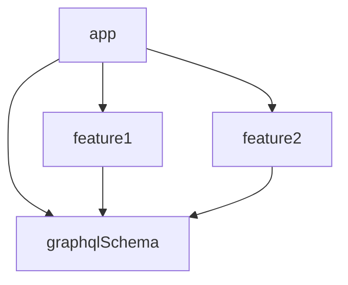

# Sample: Apollo Kotlin with multiple modules and services

This is a minimalist sample of a project with multiples modules and services
using [Apollo Kotlin](https://github.com/apollographql/apollo-kotlin).

[Documentation for the multi-module configuration](https://www.apollographql.com/docs/kotlin/advanced/multi-modules).

It contains 4 modules:

- `graphqlSchema`
    - The **schema module**, which contains the GraphQL schema for 2 services
    - Also defines 1 query for each service
- `feature1`
    - Depends on `graphqlSchema`
    - Defines 1 additional query for each service
- `feature2`
    - Depends on `graphqlSchema`
    - Defines 1 additional query for each service
- `app`
    - Depends on `graphqlSchema`, `feature1` and `feature2`
  
