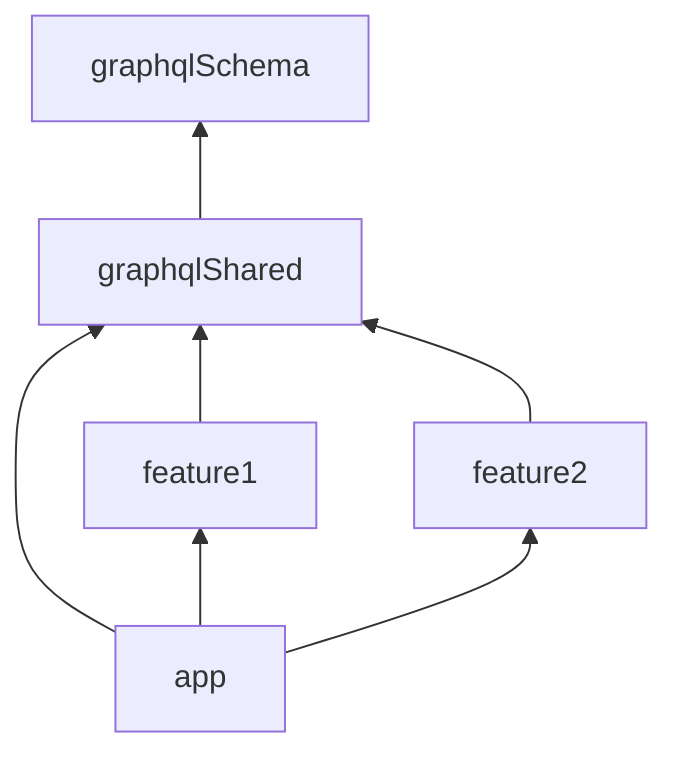

# Sample: Apollo Kotlin with multiple modules and services

This is a minimalist sample of a project with multiples modules and services
using [Apollo Kotlin](https://github.com/apollographql/apollo-kotlin).

[Documentation for the multi-module configuration](https://www.apollographql.com/docs/kotlin/advanced/multi-modules).

It contains 5 modules:

- `graphqlSchema`
    - The **schema module**, which contains the GraphQL schema for 2 services
- `graphqlShared`
  - Depends on `graphqlSchema`
  - Defines shared GraphQL operations and fragments that can be used in feature modules
- `feature1`
  - Depends on `graphqlShared`
  - Defines additional operations for each service
- `feature2`
  - Depends on `graphqlShared`
  - Defines additional operations for each service
- `app`
  - Doesn't apply the Apollo Gradle plugin (doesn't generate code)
  - Depends on `graphqlShared`, `feature1` and `feature2`
  
